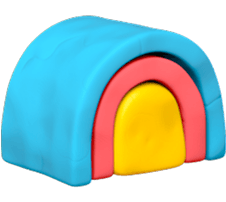

# n8n-nodes-clay



An n8n community node for integrating with Clay, the data enrichment and automation platform.

[](https://badge.fury.io/js/n8n-nodes-clay)
[](https://opensource.org/licenses/MIT)

## Features

- **Create Records**: Add new records to Clay tables via webhook
- **Update Records**: Update existing records using Clay's auto-dedupe feature
- **Field Mapping**: Manual field mapping or JSON object input
- **Error Handling**: Comprehensive error handling with user-friendly messages

## Installation

### Community Nodes

1. Go to **Settings > Community Nodes** in your n8n instance
2. Click **Install**
3. Enter `n8n-nodes-clay`
4. Click **Download**

### Manual Installation

```bash
cd ~/.n8n

npm install n8n-nodes-clay
```

## Setup

### 1. Get Your Clay API Key

1. Log into [Clay](https://app.clay.com)
2. Go to **Settings** → **API**
3. Copy your API key

### 2. Configure Credentials in n8n

1. Go to **Credentials** → **Add Credential**
2. Select "Clay API"
3. Enter your API key
4. Save the credential

## Operations

### Table Operations

- **Create Record**: Add new records to Clay tables via webhook
- **Update Record (Upsert)**: Create or update records using auto-dedupe

## Usage

### Create Record

1. Add the Clay node to your workflow
2. Select "Table" resource and "Create Record" operation
3. Enter your Workspace ID and Table ID
4. Configure the webhook URL from Clay
5. Map your data fields

### Update Record

1. Select "Update Record (Upsert)" operation
2. Enable auto-dedupe in Clay table settings
3. Include a unique identifier field
4. Map your data fields

## Requirements

- n8n version 0.187.0 or higher
- Clay account with API access

## License

MIT

## Support

For issues and questions: [GitHub Issues](https://github.com/bcharleson/n8n-nodes-clay/issues)
